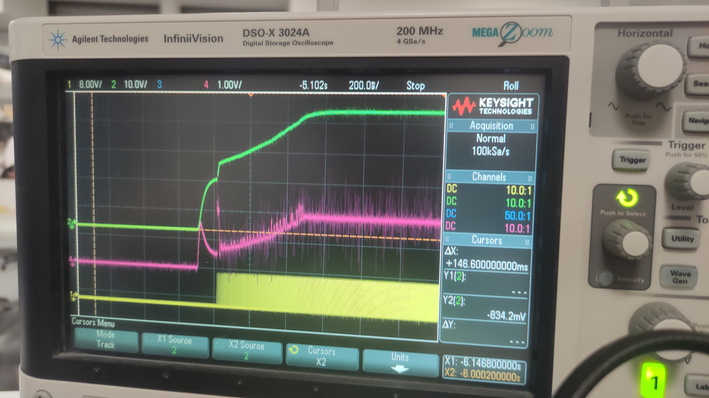
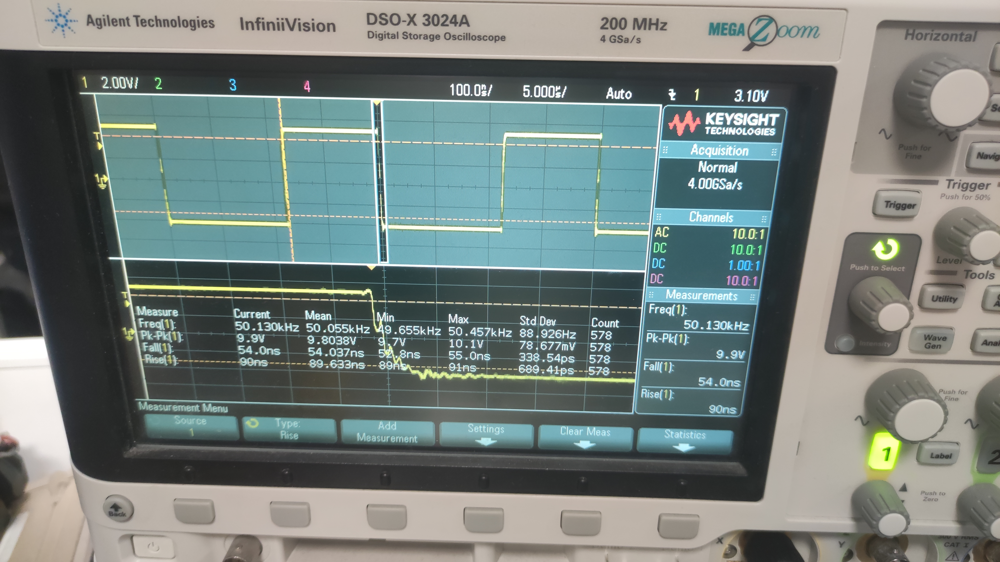
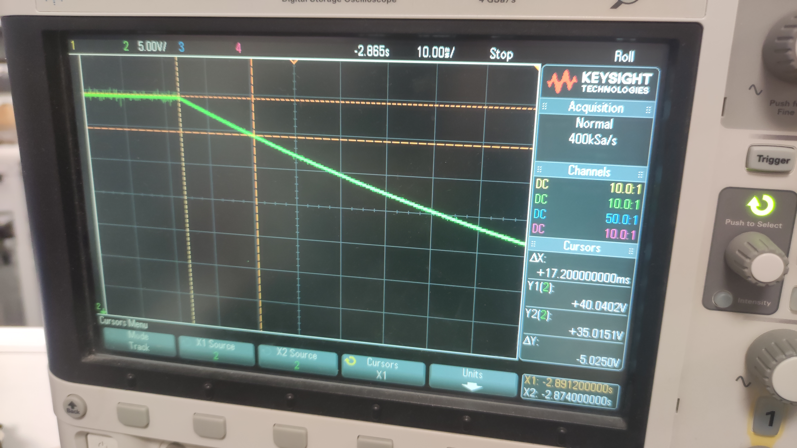

# 40W Boost PFC Converter

This repository contains the design, simulation, and implementation of a 40W Boost Power Factor Correction (PFC) converter with 40V output.

## Project Overview

This project implements a Boost PFC converter with the following specifications:

### Target Specifications
- Input: 24Vac (RMS), 50Hz (Max Input Power: 50VA)
  - Step-down transformer: TBD2 050 24 F6
- Output voltage: 40V
- Min. Power Factor: 95%
- Max. output current: 1A, continuous
- Max. output power: 40W
- Input Current ripple: 20% of peak current @ full load
- Output voltage ripple: 10% @ full load (100Hz)
- Hold-up time: 10ms @ min. output voltage of 35V
- Efficiency: >90% at full load
- Soft-Start to limit inrush current
- Control implemented digitally on a TI Tiva C series microprocessor

## LTspice DC Simulations

The `simulation/ltspice` directory contains LTspice simulation files for the DC analysis of the Boost PFC converter. These simulations help verify the basic operation of the power stage before implementing the control loop.

To run these simulations:
1. Open the .asc files with LTspice
2. Run the simulation and analyze the output waveforms

Note: The DCDCboost_Real.asc simulation uses MOSFET models from the Infineon NMOS Library. Please visit https://github.com/metacollin/LTspiceInfineonNMOSLibrary for installation instructions before running this simulation.

## MATLAB Scripts and Simulink Simulations

The repository contains MATLAB scripts and Simulink models that work together to design the controller and verify its performance.

### Component Calculation with BoostPFCData.m

The `BoostPFCData.m` script calculates the minimum values for components based on design specifications. Running this script will provide values for:
- Inductor (L)
- Output capacitor (C)

### Controller Design and Simulation Workflow

After selecting components, follow these workflows:

#### DC-DC Controller Simulation

1. First, run the DCDCTuning.m script to calculate controller parameters for the voltage controller
2. Then open and run the DCDC.slx Simulink model to simulate the DC-DC converter with the calculated controller

#### PFC Controller Simulation

1. First, run the ACDCTuning.m script to calculate PFC controller parameters (current controller, voltage controller)
2. Then open and run the BoostPFC.slx Simulink model to simulate the complete PFC converter

The Simulink models demonstrate:
- Current and voltage loop performance
- Transient response analysis
- Power factor correction effectiveness

## Hardware Files

The `hardware` folder contains the design files for the physical implementation:
- Schematic diagrams
- PCB layout images

## Software Implementation

The `software` directory contains code for the TI C2000 microcontroller implementation, including:
- Control algorithms for PFC operation
- Digital PID controller implementation
- Monitoring and protection features
- Configuration for ADC and PWM peripherals

## Results and Performance

The implemented Boost PFC converter achieves:
- High power factor (>0.95)
- Low total harmonic distortion (THD)
- Stable 40V output at 40W power rating
- Good transient response to load changes

Below are key performance measurements and waveforms from the actual hardware implementation:

### Input Voltage and Inductor Current

*The waveform shows the phase relationship between input voltage and inductor current, demonstrating high power factor operation.*

### Startup Performance

*Controlled soft-start performance showing the converter reaching steady-state without excessive overshoot. The pink line represents current with a scale of 1V = 1A, while the green line shows the output voltage. This is in DC-DC environment; in AC-DC operation, the soft-start performance would be even better.*

### MOSFET Switching Characteristics

*MOSFET switching rise and fall time measurement, showing clean switching transitions that minimize switching losses.*

### Hold-up Time Performance

*Hold-up time measurement showing output voltage staying above 35V for at least 10ms after input power loss.*

For more detailed performance metrics, refer to the simulation results and test data in their respective directories.
